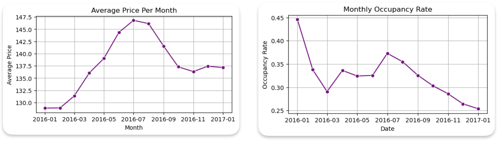
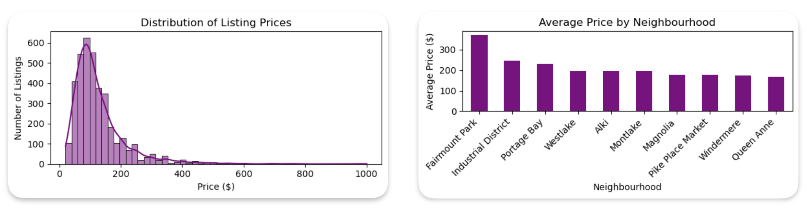
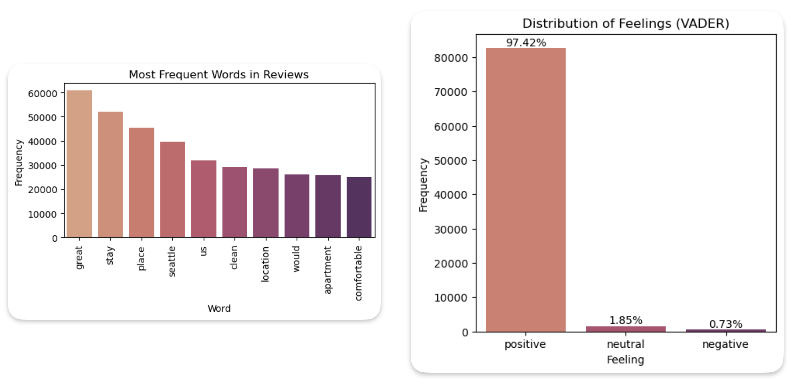
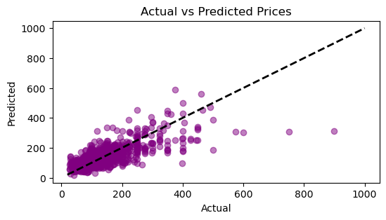

# Seattle Airbnb Data Analysis

The Seattle Airbnb dataset is a comprehensive collection of data related to
Airbnb listings in Seattle. It provides detailed information across several
aspects of the Airbnb ecosystem, including listings, calendar availability, and
user reviews.

The Seattle Airbnb dataset offers a rich source of information for analyzing
various aspects of Airbnb listings in Seattle, including trends in pricing and
availability, geographic distribution of listings, and customer satisfaction
based on reviews. This dataset is valuable for conducting detailed exploratory
data analysis (EDA), machine learning projects, and deriving insights into the
short-term rental market in Seattle.

The dataset is divided into three main files:

- `listings.csv`: Contains detailed information about each Airbnb listing in
  Seattle.
- `calendar.csv`: Provides daily availability and pricing information for each
  listing.
- `reviews.csv`: Contains user reviews for each listing.

## Project Setup

### Clone this repository

```shell
(base)$: git clone git@github.com:mafda/seattle_airbnb_data_analysis.git
(base)$: cd seattle_airbnb_data_analysis
```

### Configure environment

- Create the conda environment

    ```shell
    (base)$: conda env create -f environment.yml
    ```

- Activate the environment

    ```shell
    (base)$: conda activate seattle_airbnb
    ```

- Download the dataset from [Seattle Airbnb Open
  Data](https://www.kaggle.com/datasets/airbnb/seattle/data), create `data`
  folder and copy the data here.

    ```shell
    (seattle_airbnb)$: mkdir data
    ```

## Project Structure

```shell
.
├── README.md
├── data
│   ├── calendar.csv
│   ├── listings.csv
│   └── reviews.csv
├── environment.yml
└── src
    └── seattle_airbnb_data_analysis.ipynb
```

## Metodology

This project will follow [CRoss Industry Standard Process for Data Mining -
CRISP-DM](https://en.wikipedia.org/wiki/Cross-industry_standard_process_for_data_mining)
methodology.

### Key Highlights

- **Business Understanding**: Identify the key business questions, such as
  factors influencing occupancy rates, pricing strategies, and customer
  satisfaction.

- **Data Understanding**: Explore the structure and content of the dataset,
  including listings.csv, calendar.csv, and reviews.csv.

- **Data Preparation**: Clean and pre-process the data by handling missing
  values and converting data types.

- **Modeling**: Apply statistical and machine learning models to analyze the
  linear relationship between features and price. Use visualization techniques
  to illustrate the relationships.

- **Evaluation**: Validate the models and analysis results for accuracy and
  reliability.

- **Deployment**: Document the insights and recommendations based on the
  analysis. Provide actionable strategies for optimizing listings, pricing, and
  improving customer experience.

## Findings

Some exploratory analysis.

### Identify temporal patterns in reserves and prices

The analysis reveals a relationship between occupancy rates and prices. This
indicates a seasonal trend with peaks in winter (January) and summer (July),
followed by gradual decreases. This correlation suggests that higher occupancy
rates, likely driven by seasonal demand, are associated with higher prices.



### Determine factors that influence property prices.

The correlation matrix shows that there is a high correlation between price and
review-related variables (such as number of reviews and review score).
Significant correlations are also observed with the number of bathrooms, beds,
bedrooms, accommodation capacity and number of guests included. This suggests
that these factors are key determinants of listing prices, with larger,
better-reviewed properties tending to command higher prices.



### Evaluate customer satisfaction based on reviews

The most frequently used words in user reviews were "great," "clean,"
"location," and "comfortable." These keywords suggest that customers generally
had positive experiences and appreciated the cleanliness, location, and comfort
of the accommodations. The analysis shows that customer satisfaction is
overwhelmingly positive, with a few areas for improvement in handling
multilingual reviews.



## Data Modeling

**Linear Regression** is a simple model that attempts to capture the linear
relationship between **features and price**.
- Pros: Easy to interpret and quick to train.
- Cons: May not capture complex relationships between variables.

### Results

Although the model has a reasonable level of predictive ability, an R² of **0.558**
  also suggests that there is **44.2%** of the variability that is not being
  captured by the model, indicating that some important features could be
  missing or that the model is not complex enough to capture all relationships
  present in the data.



| Cost                      | Result |
| ------------------------- | ------ |
| Mean Absolute Error (MAE) | 38.09  |
| R² Score                  | 0.55   |

## References

- [Data Scientist Nanodegree
  Program](https://www.udacity.com/course/data-scientist-nanodegree--nd025)
- [Seattle Airbnb Dataset](https://www.kaggle.com/datasets/airbnb/seattle/data)

---

made with 💙 by [mafda](https://mafda.github.io/)
